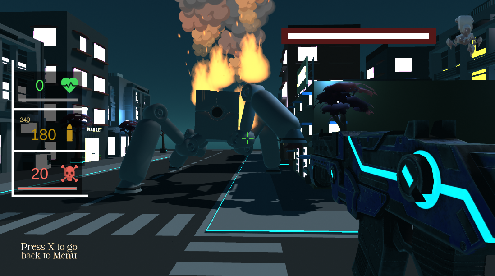

    

<h1 align="center">Cyber Futsu (Early Development Version)</h1>

Step into the futuristic battleground of <strong>Cyber Futsu</strong>, a 3D action shooter where you’ll face relentless waves of space bugs and push your skills to the limit. In this early release, we’re focused on fine-tuning game mechanics, aiming to create fast-paced, high-intensity combat for every encounter.

In <strong>Cyber Futsu</strong>, your mission is simple but daunting: eliminate the alien insect swarm lurking in dark, neon-lit arenas and survive the challenges each wave brings. As you progress, brace yourself for the ultimate showdown—a colossal, laser-shooting tentacle boss determined to annihilate all intruders.

<h2>Key Features:</h2>
<ul>
    <li><strong>Immersive 3D Environments</strong>: Experience futuristic landscapes as you navigate through each level, battling through waves of alien creatures.</li>
    <li><strong>Dynamic Enemy Mechanics</strong>: Test your reflexes and strategy as you take down various space bugs, each with unique attack patterns.</li>
    <li><strong>Epic Boss Battle</strong>: Face off against a giant, tentacled machine with devastating laser beams in an intense, action-packed climax.</li>
    <li><strong>Refinement in Progress</strong>: This release is a testing phase focused on feedback for gameplay balance and mechanics to shape the final product.</li>
</ul>

Jump in and help us shape <strong>Cyber Futsu</strong>—every bug you blast and every boss you battle brings us one step closer to perfecting this cosmic shooter experience.

